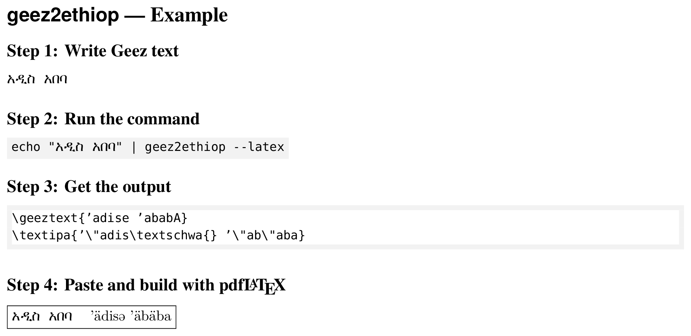

# geez2ethiop

[](https://github.com/tachi-hi/geez2ethiop/actions/workflows/ci.yml)

Convert Geez (Ethiopic) scripts into PDFLaTeX commands for the [ethiop](https://ctan.org/pkg/ethiop) package.

This module translates Geez characters to their Ethiopian Latin transcription (for use with the [ethiop](https://ctan.org/pkg/ethiop) package) and to IPA transcription (for use with the [TIPA](https://ctan.org/pkg/tipa) package) in LaTeX.

## Installation

```bash
pip install git+https://github.com/tachi-hi/geez2ethiop.git
```

For development:

```bash
git clone https://github.com/tachi-hi/geez2ethiop.git
cd geez2ethiop
pip install -e ".[dev]"
```

## Usage

### Command Line

```bash
$ echo አዲስ አበባ | geez2ethiop --latex
\geeztext{'adise 'ababA}
\textipa{'\"adis\textschwa{} '\"ab\"aba}
```

Without `--latex`:

```bash
$ echo አዲስ አበባ | geez2ethiop
አዲስ አበባ
'adise 'ababA
'\"adis\textschwa{} '\"ab\"aba
```

### Python API

```python
from geez2ethiop import geez2ethiop, ethiop2ipa

geez = "አዲስ አበባ"
ethiop = geez2ethiop(geez)   # "'adise 'ababA"
ipa = ethiop2ipa(ethiop)     # "'\"adis\\textschwa{} '\"ab\"aba"
```

See the [demo notebook](demo/demo.ipynb) for more examples
([view on nbviewer](https://nbviewer.org/github/tachi-hi/geez2ethiop/blob/main/demo/demo.ipynb),
[open in Colab](https://colab.research.google.com/github/tachi-hi/geez2ethiop/blob/main/demo/demo.ipynb)).

### Usage with PDFLaTeX

```latex
\usepackage[T1]{fontenc}
\usepackage[utf8]{inputenc}
\usepackage{tipa}
\usepackage[ethiop,main=english]{babel}
\newcommand{\geeztext}[1]{{\selectlanguage{ethiop}\mbox{#1}}}

\begin{document}
\geeztext{'adise 'ababA}
\textipa{'\"adis\textschwa{} '\"ab\"aba}
\end{document}
```

See [latex-example/example.tex](latex-example/example.tex) for a complete example.

Compiled output:



If you are interested in using XeLaTeX or LuaLaTeX, you can write Ethiopic text directly using the `fontspec` package with appropriate Ethiopic fonts.

## License

[MIT](LICENSE)
